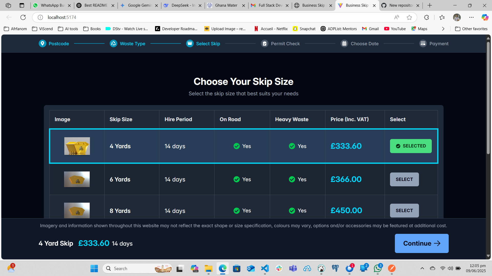

# Skip Hire Selection Page Redesign

The redesign of a streamlined online platform for selecting and ordering skip hire services.

## Table of Contents
- [Demo](#demo)
- [Features](#features)
- [Installation](#installation)
- [Usage](#usage)
- [Configuration](#configuration)
- [Project Structure](#project-structure)

## Demo


## Features

* **Location-Based Skip Availability & Pricing:** Fetches and displays skip options  and their pricing tailored to a given postcode and area.
* **Intuitive Skip Selection:** Users can effortlessly select a skip size from a comprehensive table with detailed information.
* **Real-time Order Summary:** A sticky footer provides immediate feedback on the selected skip, including its size and total price.
* **Guided Ordering Process:** A clear progress bar visually tracks the user's journey through different stages of the booking.
* **Responsive Design:** Optimized for a seamless experience across desktops, tablets, and mobile devices.
* **Robust Error Handling:** Manages data loading states and provides helpful error messages if data fetching fails.


## Installation
```bash
# Clone repository
git clone https://github.com/rolky/skiphire.git
cd skiphire

# Install dependencies
npm install

# Start development server
npm run dev
```

## Usage
1. Access the application at `http://localhost:5173`
2. On skip selection page:
   - View available skips with specifications
   - Click "SELECT" or table row to choose a skip
   - Selection details appear in sticky footer
   - Click "CONTINUE" to proceed to next step


## Project Structure
```
src/
├── components/          # Reusable UI components
│   ├── ProgressBar.jsx
│   ├── SkipSelectionTable.jsx
│   └── SelectedSkipFooter.jsx
├── layouts/             # Page layout components
│   └── PageLayout.jsx
├── pages/               # Application screens
│   └── ChooseSkipSizePage.jsx
├── services/            # API service modules
│   └── skipService.js
├── App.jsx              # Main application
└── main.jsx             # Entry point
```


